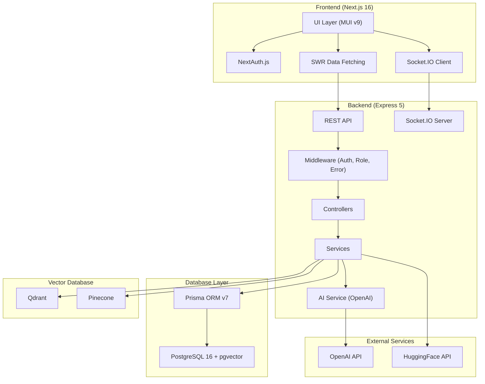
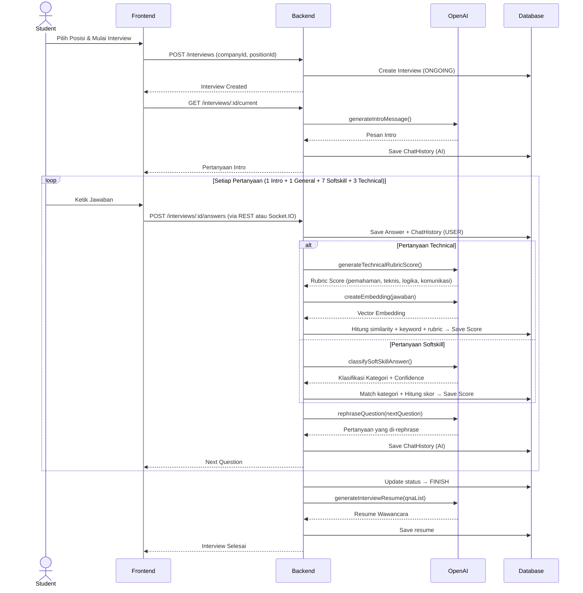
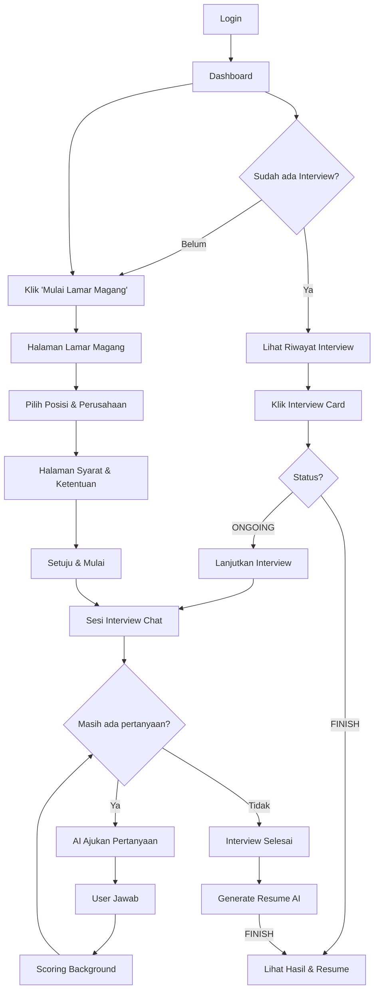

# 📋 Product Requirements Document (PRD)
# Wawancara AI — Platform Simulasi Wawancara Magang Berbasis AI

---

## 1. Informasi Umum

| Field | Detail |
|---|---|
| **Nama Produk** | Wawancara AI |
| **Versi** | 1.0.0 |
| **Tanggal** | 26 Mei 2026 |
| **Jenis Aplikasi** | Web Application (Full-stack) |
| **Target Pengguna** | Mahasiswa / Calon Magang & Perusahaan |
| **Repository BE** | `wawancara` (Backend) |
| **Repository FE** | `wawancara-fe` (Frontend) |

---

## 2. Ringkasan Produk

**Wawancara AI** adalah platform simulasi wawancara kerja/magang berbasis kecerdasan buatan (AI) yang memungkinkan mahasiswa/calon magang untuk berlatih wawancara secara interaktif melalui antarmuka chat. Sistem ini menggunakan **OpenAI GPT** untuk menghasilkan pertanyaan yang natural, mengevaluasi jawaban secara otomatis, dan memberikan skor serta feedback yang komprehensif.

### Tujuan Utama
1. Memberikan pengalaman simulasi wawancara yang realistis dan interaktif
2. Menilai jawaban kandidat secara otomatis menggunakan AI multi-dimensional scoring
3. Memberikan feedback dan resume wawancara yang konstruktif
4. Membantu perusahaan mengelola proses seleksi awal secara efisien

---

## 3. Arsitektur Sistem



---

## 4. Tech Stack

### 4.1 Backend (`wawancara`)

| Kategori | Teknologi | Versi |
|---|---|---|
| **Runtime** | Node.js (TypeScript) | - |
| **Framework** | Express.js | 5.1.0 |
| **ORM** | Prisma Client | 7 |
| **Database** | PostgreSQL + pgvector | 16 (Alpine) |
| **Authentication** | Passport.js (Local + JWT) | 0.7.0 |
| **Real-time** | Socket.IO | 4.8.3 |
| **AI Provider** | OpenAI SDK | 6.7.0 |
| **Vector DB** | Qdrant + Pinecone | - |
| **Embedding** | HuggingFace Inference | 4.13.2 |
| **Validation** | fastest-validator | 1.19.1 |
| **Logging** | Winston + Morgan | - |
| **Hashing** | bcrypt | 6.0.0 |
| **Container** | Docker Compose | - |

### 4.2 Frontend (`wawancara-fe`)

| Kategori | Teknologi | Versi |
|---|---|---|
| **Framework** | Next.js | 16.2.4 |
| **UI Library** | Material UI (MUI) | 9.0.0 |
| **State/Data** | SWR | 2.4.1 |
| **Authentication** | NextAuth.js | 4.24.14 |
| **HTTP Client** | Axios | 1.16.0 |
| **Form Handling** | Formik + Yup | 2.4.9 / 1.7.1 |
| **Real-time** | Socket.IO Client | 4.8.3 |
| **Styling** | Tailwind CSS + Emotion | 4 / 11.14.0 |
| **Language** | TypeScript | 5 |

---

## 5. Database Schema

### 5.1 Entity Relationship Diagram

```dbml
Table User {
  id int [pk, increment]
  name varchar
  username varchar [unique]
  password varchar
  role enum('ADMIN', 'COMPANY', 'STUDENT', 'PSYCHOLOGIST')
  createdAt datetime
  updatedAt datetime
}

Table Company {
  id int [pk, increment]
  name varchar
  createdAt datetime
  updatedAt datetime
}

Table Position {
  id int [pk, increment]
  companyId int [ref: > Company.id]
  name varchar
  createdAt datetime
  updatedAt datetime
}

Table Interview {
  id int [pk, increment]
  userId int [ref: > User.id]
  companyId int [ref: > Company.id]
  positionId int [ref: > Position.id]
  status enum('ONGOING', 'FINISH')
  resume text
  resumePrompt text
  createdAt datetime
  updatedAt datetime
}

Table QuestionCategory {
  id int [pk, increment]
  name varchar
  createdAt datetime
  updatedAt datetime
}

Table Question {
  id int [pk, increment]
  content text
  difficulty varchar
  type enum('INTRO', 'GENERAL', 'TECHNICAL', 'SOFTSKILL')
  categoryId int [ref: > QuestionCategory.id]
  createdAt datetime
  updatedAt datetime
}

Table Answer {
  id int [pk, increment]
  questionId int [ref: > Question.id]
  interviewId int [ref: > Interview.id]
  userId int [ref: > User.id]
  content text
  createdAt datetime
  updatedAt datetime
}

Table Keyword {
  id int [pk, increment]
  questionId int [ref: > Question.id]
  word varchar
  weight float
}

Table IdealAnswer {
  id int [pk, increment]
  questionId int [ref: > Question.id]
  content text
  embedding vector
}

Table AnswerCategory {
  id int [pk, increment]
  questionId int [ref: > Question.id]
  label varchar
  score int
}

Table Score {
  id int [pk, increment]
  answerId int [unique, ref: > Answer.id]
  type enum('TECHNICAL', 'SOFTSKILL')
  finalScore float
  similarityScore float
  keywordScore float
  confidenceScore float
  feedback text
  reason text
  prompt text
  rubricScore float
  categoryId int [ref: > AnswerCategory.id]
  categoryLabel varchar
}

Table ChatHistory {
  id int [pk, increment]
  interviewId int [ref: > Interview.id]
  role enum('AI', 'USER')
  content text
  questionId int [ref: > Question.id]
}
```

### 5.2 Tabel & Penjelasan

| Model | Deskripsi |
|---|---|
| **User** | Pengguna platform dengan 4 role: Admin, Company, Student, Psychologist |
| **Company** | Data perusahaan yang menawarkan posisi magang |
| **Position** | Posisi/jabatan magang yang tersedia per perusahaan |
| **Interview** | Sesi wawancara antara User (Student) dengan Company untuk Position tertentu |
| **Question** | Bank soal wawancara dengan 4 tipe: Intro, General, Technical, Softskill |
| **QuestionCategory** | Kategori pertanyaan (Personal, Motivation, Backend, Security, dsb.) |
| **Answer** | Jawaban kandidat terhadap pertanyaan dalam sesi interview |
| **Keyword** | Kata kunci yang diharapkan muncul dalam jawaban (berbobot) |
| **IdealAnswer** | Jawaban ideal yang di-generate AI, disimpan dengan embedding vector untuk similarity search |
| **AnswerCategory** | Kategori klasifikasi jawaban untuk pertanyaan soft skill (berlabel + berskor) |
| **Score** | Hasil penilaian jawaban: skor final, similarity, keyword coverage, confidence, dan feedback |
| **ChatHistory** | Riwayat percakapan (AI & User) dalam sesi interview |

---

## 6. User Roles & Permissions

| Role | Deskripsi | Akses |
|---|---|---|
| **ADMIN** | Administrator sistem | Kelola setting, prompt template, CRUD pertanyaan, akses penuh |
| **COMPANY** | Perusahaan/Pemberi magang | Mengelola posisi dan melihat hasil interview |
| **STUDENT** | Mahasiswa/Calon magang | Melamar magang, mengikuti interview, melihat hasil |
| **PSYCHOLOGIST** | Psikolog | Akses evaluasi dan analisis jawaban |

---

## 7. Fitur Utama

### 7.1 Autentikasi & Otorisasi

| Fitur | Deskripsi |
|---|---|
| **Register** | Pendaftaran akun baru dengan name, username, password, dan role |
| **Login** | Autentikasi menggunakan username + password (Passport Local Strategy) |
| **JWT Token** | Token JWT dengan masa berlaku 1 hari untuk mengakses API |
| **Me** | Endpoint untuk mendapatkan informasi user yang sedang login |
| **Logout** | Mengakhiri sesi pengguna |
| **Role-based Access** | Middleware `role()` untuk membatasi akses berdasarkan role |

### 7.2 Manajemen Perusahaan & Posisi

| Fitur | Deskripsi |
|---|---|
| **Daftar Perusahaan** | Menampilkan daftar perusahaan yang tersedia |
| **Daftar Posisi** | Menampilkan daftar posisi magang beserta info perusahaan |
| **Lamar Magang** | Student memilih posisi dan memulai proses interview |

### 7.3 Interview Session (Fitur Inti)

#### 7.3.1 Alur Interview



#### 7.3.2 Distribusi Pertanyaan

| Tipe Pertanyaan | Jumlah | Deskripsi |
|---|---|---|
| **INTRO** | 1 | Sapaan pembuka dari AI, menyebutkan nama kandidat, perusahaan, dan posisi |
| **GENERAL** | 1 | Pertanyaan umum tentang motivasi dan tujuan karir |
| **SOFTSKILL** | 7 | Pertanyaan tentang adaptasi, komunikasi, problem solving, leadership, time management, self confidence |
| **TECHNICAL** | 3 | Pertanyaan teknis sesuai bidang (JWT, REST API, Database, MVC, Security, dsb.) |
| **Total** | **12** | Total pertanyaan per sesi wawancara |

#### 7.3.3 Real-time Communication (Socket.IO)

| Event | Direction | Deskripsi |
|---|---|---|
| `join-interview` | Client → Server | Student bergabung ke room interview |
| `joined-interview` | Server → Client | Konfirmasi berhasil join |
| `submit-answer` | Client → Server | Mengirim jawaban (interviewId, answer, questionId) |
| `answer-saved` | Server → Client | Konfirmasi jawaban tersimpan |
| `new-question` | Server → Client | Pertanyaan berikutnya dikirim |
| `interview-finished` | Server → Client | Notifikasi interview selesai |
| `error` | Server → Client | Error handling |

#### 7.3.4 Fitur Fullscreen Mode

- Saat interview berlangsung, user dapat masuk mode fullscreen
- Saat interview belum selesai, user **tidak dapat keluar** dari fullscreen (muncul warning dialog)
- Setelah interview selesai, fullscreen bisa dimatikan secara normal

### 7.4 Sistem Penilaian (Scoring Engine)

#### 7.4.1 Scoring Teknikal

Penilaian jawaban teknis menggunakan **3 komponen** yang di-bobot:

| Komponen | Bobot | Metode |
|---|---|---|
| **Rubric AI Score** | 40% | OpenAI menilai 4 aspek: Pemahaman (0-5), Teknis (0-5), Logika (0-5), Komunikasi (0-5) |
| **Similarity Score** | 30% | Cosine similarity antara embedding jawaban user dengan Ideal Answer menggunakan pgvector |
| **Keyword Score** | 30% | Persentase kata kunci yang muncul dalam jawaban user |

**Formula:**
```
finalScore = (rubricScore × 0.4 + similarityScore × 0.3 + keywordScore × 0.3) × 100
```

**Confidence Score:**
```
evidenceAlignment = rubricScore × 0.5 + similarityConfidence × 0.25 + keywordCoverage × 0.25
confidenceScore = rubricConfidence × 0.45 + evidenceAlignment × 0.45 + (finalScore >= 50 ? 0.1 : 0)
```

#### 7.4.2 Scoring Soft Skill

Penilaian soft skill menggunakan **klasifikasi kategori + similarity**:

| Komponen | Bobot (dengan keyword) | Bobot (tanpa keyword) |
|---|---|---|
| **Category Score** | 50% | 70% |
| **Similarity Score** | 25% | 30% |
| **Keyword Score** | 25% | — |

**Proses:**
1. AI mengklasifikasikan jawaban ke salah satu kategori yang sudah ditentukan per pertanyaan
2. String similarity matching untuk menemukan kategori terdekat jika tidak exact match
3. Skor akhir = bobot kategori + cosine similarity + keyword coverage

#### 7.4.3 Retry Mechanism

- Jika confidence AI rendah pada scoring pertama, sistem otomatis melakukan **retry** dengan hint yang lebih konservatif
- Retry hint mendorong AI untuk "menurunkan confidence dan fokus pada bukti eksplisit"

#### 7.4.4 Auto-Promotion to Ideal Answer

- Jika `finalScore >= 80`, jawaban user otomatis dipromosikan menjadi **Ideal Answer** baru
- Embedding disimpan ke pgvector, Pinecone, dan Qdrant
- Mekanisme self-improving: semakin banyak jawaban bagus, semakin akurat similarity scoring

### 7.5 Resume Wawancara (AI-Generated)

Setelah interview selesai, sistem otomatis:
1. Mengumpulkan seluruh pasangan Q&A dari chat history
2. Mengirim ke OpenAI untuk generate **resume profesional**
3. Resume berisi evaluasi umum: kelebihan, kekurangan, dan poin penting dari jawaban kandidat
4. Resume dan prompt disimpan ke database interview

### 7.6 Manajemen Pertanyaan

| Fitur | Endpoint | Deskripsi |
|---|---|---|
| **List Questions** | `GET /questions` | Daftar semua pertanyaan dengan keyword & ideal answer |
| **Get Question** | `GET /questions/:id` | Detail satu pertanyaan |
| **Create Question** | `POST /questions` | Buat pertanyaan baru (content, category, type, difficulty, keywords) |
| **Update Question** | `PUT /questions/:id` | Edit pertanyaan |
| **Delete Question** | `DELETE /questions/:id` | Hapus pertanyaan (cascade: answer, score, keyword) |
| **Add Ideal Answer** | `POST /questions/:id/ideal-answer` | Tambah jawaban ideal dengan embedding |
| **Remove Ideal Answer** | `DELETE /questions/:id/ideal-answer/:idealAnswerId` | Hapus jawaban ideal |

### 7.7 AI Service Functions

| Fungsi | Deskripsi |
|---|---|
| `createEmbedding()` | Menghasilkan text embedding (3072 dimensi) via OpenAI `text-embedding-3-large` |
| `generateMessage()` | Generate pesan AI umum |
| `validateInterviewInput()` | Validasi relevansi, sopan santun, dan kesesuaian jawaban |
| `generateMinLength()` | Estimasi panjang minimal jawaban yang memadai |
| `generateKeyword()` | Generate 5 kata kunci spesifik untuk evaluasi jawaban |
| `generateQuestion()` | Generate pertanyaan interview baru |
| `generateAnswerAI()` | Generate jawaban kandidat ideal |
| `generateAIScore()` | Scoring multi-rubrik (pemahaman, logika, problem solving, komunikasi) |
| `generateTechnicalRubricScore()` | Scoring teknis dengan rubrik (pemahaman, teknis, logika, komunikasi) + confidence |
| `classifySoftSkillAnswer()` | Klasifikasi jawaban soft skill ke kategori yang tersedia + confidence |
| `generateAnswerCategories()` | Generate kategori jawaban soft skill (label + score 1-5) |
| `generateIdealAnswer()` | Generate 1 jawaban ideal singkat dan natural |
| `generateInterviewResume()` | Generate resume/ringkasan evaluasi dari seluruh Q&A |
| `generateIntroMessage()` | Generate sapaan pembuka interview (menyebutkan nama, perusahaan, posisi) |
| `rephraseQuestion()` | Rephrase pertanyaan agar lebih natural dan bervariasi |

### 7.8 Admin Settings

| Fitur | Deskripsi |
|---|---|
| **Get Prompt Template** | Mengambil template prompt yang digunakan |
| **Update Prompt Template** | Mengubah template prompt AI |
| **Get Setting** | Mengambil konfigurasi sistem |
| **Update Setting** | Memperbarui konfigurasi sistem |

---

## 8. API Endpoints

### 8.1 Authentication

| Method | Endpoint | Auth | Deskripsi |
|---|---|---|---|
| `POST` | `/auth/login` | ❌ | Login dengan username & password |
| `POST` | `/auth/register` | ❌ | Register akun baru |
| `GET` | `/auth/me` | ✅ | Info user yang login |
| `POST` | `/auth/logout` | ✅ | Logout |

### 8.2 Interview

| Method | Endpoint | Auth | Deskripsi |
|---|---|---|---|
| `GET` | `/interviews` | ✅ | Daftar interview user |
| `POST` | `/interviews` | ✅ | Mulai interview baru |
| `GET` | `/interviews/:id/current` | ✅ | Pertanyaan saat ini |
| `POST` | `/interviews/:id/answers` | ✅ | Kirim jawaban |
| `POST` | `/interviews/:id/finish` | ✅ | Akhiri interview |
| `GET` | `/interviews/:id/result` | ✅ | Hasil interview (answer + score) |
| `GET` | `/interviews/:id/history` | ✅ | Riwayat chat interview |

### 8.3 Questions

| Method | Endpoint | Auth | Deskripsi |
|---|---|---|---|
| `GET` | `/questions` | ✅ | Semua pertanyaan |
| `GET` | `/questions/:id` | ✅ | Detail pertanyaan |
| `POST` | `/questions` | ✅ | Buat pertanyaan baru |
| `PUT` | `/questions/:id` | ✅ | Edit pertanyaan |
| `DELETE` | `/questions/:id` | ✅ | Hapus pertanyaan |
| `POST` | `/questions/:id/ideal-answer` | ✅ | Tambah ideal answer |
| `DELETE` | `/questions/:id/ideal-answer/:idealAnswerId` | ✅ | Hapus ideal answer |

### 8.4 AI

| Method | Endpoint | Auth | Deskripsi |
|---|---|---|---|
| `POST` | `/ai/generate` | ✅ | Generate pesan AI + validasi input |
| `POST` | `/ai/generate2` | ✅ | Generate via HuggingFace |
| `POST` | `/ai/embed` | ✅ | Embed text ke vector |
| `POST` | `/ai/embed-qa` | ✅ | Embed pasangan Q&A ke Qdrant |
| `POST` | `/ai/search` | ✅ | Search similar vectors |
| `GET` | `/ai/list` | ✅ | List data di Pinecone |
| `GET` | `/ai/generate-question` | ✅ | Generate pertanyaan baru |
| `POST` | `/ai/score` | ✅ | Score jawaban secara manual |

### 8.5 Company & Position

| Method | Endpoint | Auth | Deskripsi |
|---|---|---|---|
| `GET` | `/company` | ✅ | Daftar perusahaan |
| `GET` | `/position` | ✅ | Daftar posisi (include company) |

### 8.6 Settings (Admin Only)

| Method | Endpoint | Auth | Role | Deskripsi |
|---|---|---|---|---|
| `GET` | `/setting/prompt-template` | ✅ | ADMIN | Get prompt template |
| `POST` | `/setting/prompt-template` | ✅ | ADMIN | Update prompt template |
| `GET` | `/setting` | ✅ | ADMIN | Get settings |
| `POST` | `/setting` | ✅ | ADMIN | Update settings |

---

## 9. Halaman Frontend

### 9.1 Peta Halaman

| Route | Halaman | Deskripsi |
|---|---|---|
| `/login` | Login Page | Halaman login dengan form username/password |
| `/` | Dashboard | Halaman utama — sapaan + daftar riwayat interview |
| `/internship-applications` | Lamar Magang | Daftar posisi tersedia, tombol "Mulai Interview" |
| `/interview/terms` | Syarat & Ketentuan | Halaman persetujuan sebelum memulai interview |
| `/interview/[id]` | Sesi Interview | Chat interface — pertanyaan AI & input jawaban |

### 9.2 Komponen Utama

| Komponen | File | Deskripsi |
|---|---|---|
| **Navigation** | `components/navigation.tsx` | Navbar responsif dengan menu navigasi dan logout |
| **Providers** | `components/providers.tsx` | Context providers (MUI Theme, NextAuth Session, SWR) |

### 9.3 Alur Pengguna (User Flow)



---

## 10. Deployment & Infrastructure

### 10.1 Docker Compose

Proyek backend menggunakan Docker Compose dengan 2 service:

| Service | Image | Port | Deskripsi |
|---|---|---|---|
| **postgres** | `pgvector/pgvector:pg16-alpine` | 5432 | PostgreSQL dengan ekstensi pgvector untuk similarity search |
| **backend** | Custom Dockerfile | 5000 | Express.js API server |

### 10.2 Environment Variables

| Variable | Deskripsi |
|---|---|
| `BASE_URL` | Base URL server |
| `PORT` | Port server (default: 5000) |
| `DATABASE_URL` | PostgreSQL connection string |
| `SECRET_KEY` | Secret key untuk JWT signing |
| `OPENAI_API_KEY` | API key untuk OpenAI |
| `OPENAI_MODEL` | Model GPT yang digunakan (e.g., `gpt-4`) |
| `OPENAI_TEMPERATURE` | Temperature parameter untuk AI response |
| `OPENAI_EMBEDDING_MODEL` | Model embedding (e.g., `text-embedding-3-large`) |
| `HF_KEY` | HuggingFace API key |
| `PINECONE_API_KEY` | Pinecone API key |
| `PINECONE_HOST_URL` | Pinecone host URL |
| `PINECONE_INDEX_NAME` | Nama index Pinecone |
| `QDRANT_API_KEY` | Qdrant API key |
| `QDRANT_HOST_URL` | Qdrant host URL |

### 10.3 Frontend Environment

| Variable | Deskripsi |
|---|---|
| `NEXT_PUBLIC_API_URL` | URL backend API untuk client-side requests |
| `NEXTAUTH_SECRET` | Secret untuk NextAuth.js session encryption |

---

## 11. Seed Data

Sistem di-seed dengan data awal berikut:

### 11.1 Users
- 1 Admin (`admin` / `admin`)

### 11.2 Companies & Positions
| Perusahaan | Posisi |
|---|---|
| Tokopedia | Backend Developer |
| Gojek | Frontend Developer |
| Shopee | Fullstack Developer |

### 11.3 Question Categories (14)
Personal, Motivation, Personality, Teamwork, Time Management, Adaptability, Stress Management, Backend, Database, Security, Communication, Problem Solving, Leadership, Self Confidence

### 11.4 Questions (26)
- **2** INTRO (Personal)
- **2** GENERAL (Motivation)
- **16** SOFTSKILL (Adaptability, Communication, Problem Solving, Leadership, Time Management, Self Confidence)
- **6** TECHNICAL (Security, Database, Backend)

Setiap pertanyaan di-seed dengan:
- **5 kata kunci** yang di-generate AI
- **3 ideal answer** dengan embedding vector
- **Answer categories** untuk pertanyaan SOFTSKILL (3-5 kategori berskor)

---

## 12. Non-Functional Requirements

### 12.1 Performa
- Real-time chat via Socket.IO dengan latency < 1 detik
- Background scoring (async) agar tidak memblok response ke user
- Pseudo-random question selection untuk variasi pertanyaan antar interview
- Generation lock mechanism untuk mencegah duplikasi pertanyaan

### 12.2 Keamanan
- Password di-hash menggunakan bcrypt (salt rounds: 10)
- JWT token dengan expiry 1 hari
- Middleware auth pada setiap endpoint yang memerlukan login
- Role-based access control (RBAC) untuk endpoint admin
- Socket.IO authentication via token
- Validasi input menggunakan fastest-validator di setiap endpoint
- Prevention: user tidak bisa interview ulang untuk posisi yang sama

### 12.3 Skalabilitas
- Arsitektur service-oriented (controller → service → database)
- Docker Compose untuk deployment yang reproducible
- Vector database terpisah (Qdrant / Pinecone) untuk similarity search yang scalable
- pgvector sebagai fallback similarity search yang embedded di PostgreSQL

### 12.4 Reliability
- Error handling middleware dengan custom exception classes (BadRequest, NotFound, Forbidden, Unauthorized)
- Scoring error logging ke file (`scoring.log`)
- Application logging via Winston (`application.log`)
- Request logging via Morgan
- Retry mechanism pada AI scoring untuk meningkatkan confidence

### 12.5 User Experience
- Chat interface yang responsive dan intuitif
- Animasi slide-in pada message bubbles
- Progress bar menunjukkan kemajuan interview
- Fullscreen mode untuk mengurangi distraksi saat interview
- Loading states dan skeleton screens saat fetching data
- Gradient colors dan modern UI dengan MUI v9
- Score display inline di setiap jawaban setelah interview selesai
- Resume AI yang komprehensif dan memotivasi

---

## 13. Batasan & Keterbatasan Saat Ini

| # | Batasan | Dampak |
|---|---|---|
| 1 | Pertanyaan diambil dari bank soal yang sudah di-seed, bukan fully dynamic | Variasi pertanyaan terbatas pada bank soal |
| 2 | Scoring hanya untuk tipe TECHNICAL dan SOFTSKILL | INTRO dan GENERAL tidak dinilai/diskor |
| 3 | Belum ada dashboard khusus untuk role COMPANY dan PSYCHOLOGIST | Fitur role tersebut belum diimplementasikan di FE |
| 4 | Sistem hanya mendukung text-based interview | Belum ada dukungan voice/video interview |
| 5 | 1 user hanya bisa interview 1x per posisi per perusahaan | Tidak ada mekanisme retry interview |
| 6 | Fullscreen restriction bisa di-bypass via browser devtools | Bukan hard enforcement, hanya soft restriction |

---

## 14. Glosarium

| Istilah | Definisi |
|---|---|
| **Cosine Similarity** | Metode pengukuran kemiripan antara dua vektor berdasarkan sudut cosinus |
| **Embedding** | Representasi teks dalam bentuk vektor numerik berdimensi tinggi |
| **pgvector** | Ekstensi PostgreSQL untuk menyimpan dan query vektor |
| **Rubric Score** | Penilaian berdasarkan rubrik (kriteria terstruktur) oleh AI |
| **Ideal Answer** | Jawaban referensi yang dianggap ideal untuk suatu pertanyaan |
| **Rephrase** | Penulisan ulang pertanyaan agar lebih natural dan bervariasi |
| **Confidence Score** | Tingkat keyakinan AI terhadap hasil penilaian |
| **Auto-Promotion** | Mekanisme otomatis menjadikan jawaban bagus (score ≥ 80) sebagai Ideal Answer baru |
